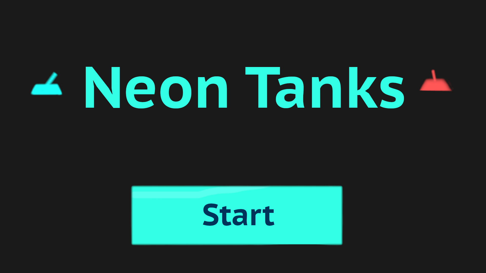
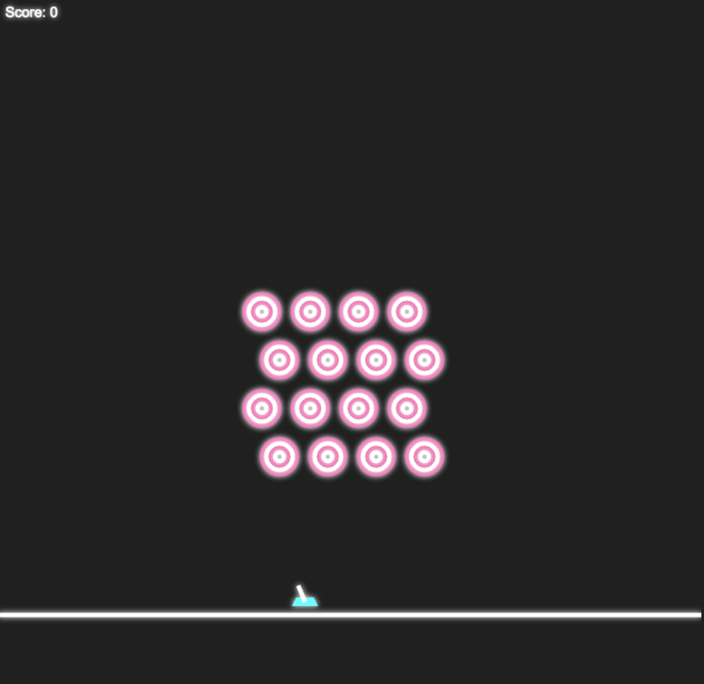

# NeonTanks

## Background and Overview

NeonTanks is a projectile based game, inspired by GunBound and ShellShock Live. The goal is to play hit targets and gain the highest score.


## Functionality and MVP Features
* [ ] Users will be able to move their tank, move their mouse, and aim for a target. 
* [ ] Projectiles will leave the barrel of the gun and fly in an arc
* [ ] Projectiles will hit targets
* [ ] Score will be displayed at the end of the level
* [ ] Collisions will be fireworks and and death animation will also be in place
* [ ] Background music, tank movement music, collision music, and explosion music

### Bonus 
* [ ] Users can play through 4 levels of Neon Tanks
* [ ] Users can choose their own tanks that shoot different geometric projectiles


## Code Snippets
### Util file 
```
    angle(initialPos, mousePos){
        const hypotenuse = Util.distance(initialPos, mousePos);
        const xDist = (mousePos[0] - initialPos[0]); 
        const resultAngle = Math.acos(xDist / hypotenuse) || 1.57;
        return resultAngle;
    }, 
    //want to return a pos from distance to be a set value like 20px
    gunEndPos(initialPos, mousePos){
        //gets the angle from the initalPos and the mousePos
        angle = Util.angle(initialPos, mousePos);


        //rendering the new pos of the endpoint of the gun based on the angles
        let pos = [];
        //don't want people to shoot from the direct right or direct left 
        //limiters on the angle dependent on the mouse 
        if (angle < 0.54) {
            angle = 0.54
        }
        if (angle > 2.6 ) {
            angle = 2.6
        }

        //20 will the length of the gun
        //hypotenuse * Math.cos(angle) 
        pos.push(20 * Math.cos(angle));
        pos.push(20 * Math.sin(angle));

        return [pos[0] + initialPos[0],  initialPos[1] - pos[1]]; 
    }
```




## Architecture and Technologies
  * Javascript for the game logic 
  * HTML5 Canvas for render
  * Web Audio API for music and collision sounds 
  * Webpack for importing and exporting between files

## Implementation Timeline
  * Day 1: Learn the basic physics necessary for tank movement and create canvas background and assets
  * Day 2: Create the shooting mechanics / physics for the tanks 
  * Day 3: Targets will randomly spawn around the background
  * Day 4: Collision and animation will be handled
  * Day 5: Adding sound to the tank movement, explosions, and 
  * Day 6: Creating a game menu for start, pause, and score 