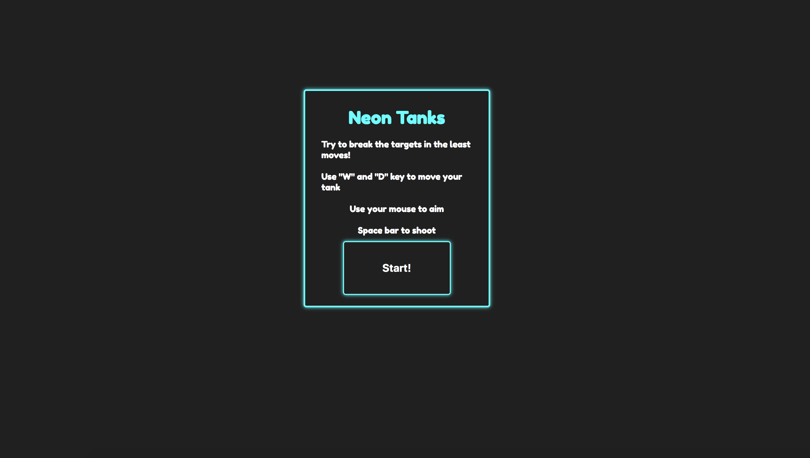

# NeonTanks

## Background and Overview

NeonTanks is a projectile based game, inspired by GunBound and ShellShock Live. The goal is to play hit targets and gain the highest score.

## Functionality and MVP Features
* [ ] Users will be able to move their tank, move their mouse, and aim for a target. 
* [ ] Projectiles will leave the barrel of the gun and fly in an arc
* [ ] Projectiles will hit targets
* [ ] Score will be displayed at the end of the level
* [ ] Collisions will be fireworks and and death animation will also be in place
* [ ] Background music, tank movement music, collision music, and explosion music

### Bonus 
* [ ] Users can play through 4 levels of Neon Tanks
* [ ] Users can choose their own tanks that shoot different geometric projectiles

## Architecture and Technologies
  * Javascript for the game logic 
  * HTML5 Canvas for render
  * Web Audio API for music and collision sounds 
  * Webpack for importing and exporting between files

## Implementation Timeline
  * Day 1: Learn the basic physics necessary for tank movement and create canvas background and assets
  * Day 2: Create the shooting mechanics / physics for the tanks 
  * Day 3: Targets will randomly spawn around the background
  * Day 4: Collision and animation will be handled
  * Day 5: Adding sound to the tank movement, explosions, and 
  * Day 6: Creating a game menu for start, pause, and score 